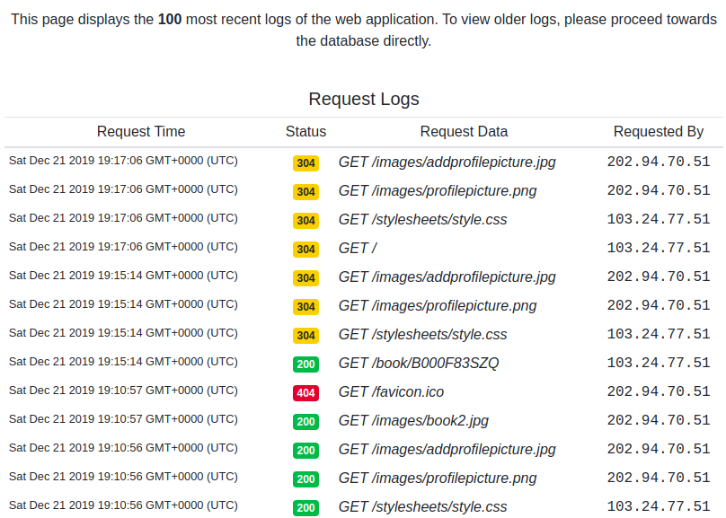

# Goodreads

### A project by team BIG Data 
*[Chok Hao Ze, Edric, James Andrew Pohadi, Kundan Dalmia,Sanjay Shankar, Tan You, Vieri Vincent]*

<p align='center'>  
  
</p>

## Prerequisites:
1. Install jq
```
sudo apt-get install jq
```
2. Clean: No existing instances, security groups, keys, etc. (The reason is that existing keys or security group names that are similar to our group's might cause error while running)

## 50.043 Database and Big Data Systems 2019

This project consists of:
- Web clusters which can be setup using web automation:
```
bash launch.sh 1
```
Once it is done, you can view the web by opening ```http://<web-server>:3000/```, where the value of *web-server* can be seen from *web/instance.json*

- Analytics clusters which can be setup using analytics automation:
```
bash launch.sh 2 <num of clusters>
```
where ```<num of clusters>``` = {2,4,8}
The status of Spark can be seen from ```http://<node_master.publicdns>:8080```, where *node_master.publicdns* value can be seen from *hadoop/analytics_instances.json*

Optionally, you can launch web and analytics together:
```
bash launch.sh 3 <num of clusters>
```
where ```<num of clusters>``` = {2,4,8}
You might need to press ctrl + C to exit web supervisor so that the automation script can continue

Web clusters are running on EC2 **t2.medium** instances, while automation clusters are running on EC2 **t2.large** instances.

## Completed Tasks

<p align='center'>  
  
</p>
<p align='center'>  
  
</p>
<p align='center'>  
  
</p>

We have completed all the tasks given for the project. We also implements some additional features on top of the basic one.

### Frontend

Completed features:
1. See reviews
2. Add new review
3. Add new book
4. Logs
4. Signup/Login (additional)
5. Search by book title (additional)
6. Sorting (additional)
7. User page (additional)

Logs can be access from ```http://<web-server>:3000/logs```

### Backend

#### Production [Expected time: 15 mins]

Expected setting up time: 15 mins

- Node Express js with ejs backend

#### Analytics [Expected time: 30 mins]

Expected setting up time: 10 mins

Implemented in pyspark map reduce operation to compute pearson correlation and tfidf (without ML lib)

- Pearson Correlation
- Tfidf

Expected running time on 2 clusters:
- Pearson Correlation: 30s
- Tfidf: 10 mins

***NOTE: For the Pearson Correlation, we replaced all the NULL values in the data with zero. Hence the output maybe differ accordingly.***

## How to access the result files for the Analytics:
You can find the results for TF-IDF in:
```
./hadoop/tfidf_result
```
The results are stored in the multiple different files due to the usage of Map Reduce to optimise performance.

Likewise, you can also find the results for Pearson Correlation in:
```
./hadoop/pearson_correlation_result
```
Once again, note that for the Pearson Correlation, the team has replaced all the NULL values in the data with Zero.


## Common problems

1. Poor internet connection could cause ssh to not connect to instances after several trials. This would usually cause the web to not run properly because some of web server/mysql server/mongo server are not up.

**Solution**: Please run again. 
Need to delete existing SECURITY_GROUP1 and SECURITY_GROUP3, instances (since running back the script will create new instances). DO NOT DELETE deployKey ! (if deployKey is deleted from AWS, need to delete deployKey.pem file in the local)

**If you have any queries or issues, please contact one of the team members through SUTD email directory. Thank you :)**
