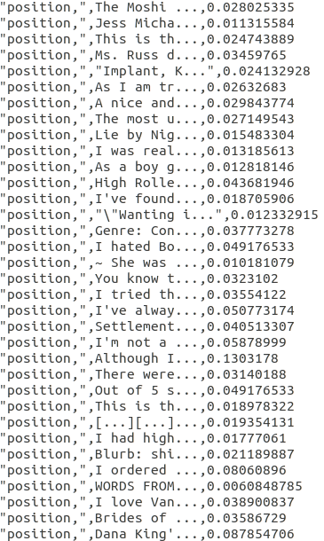
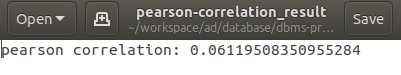

# Goodreads

### A project by team BIG Data 
*[Chok Hao Ze, Edric, James Andrew Pohadi, Kundan Dalmia,Sanjay Shankar, Tan You, Vieri Vincent]*

<p align='center'>  
  
</p>

## Prerequisites:
1. Install jq
```
sudo apt-get install jq
```
2. Clean: No existing instances, security groups, keys, etc. (The reason is that existing keys or security group names that are similar to our group's might cause error while running)

## 50.043 Database and Big Data Systems 2019

This project consists of:
- Web clusters which can be setup using web automation:
```
bash launch.sh 1 <key name without extension>
```
note that if the key does not exist, it will be automatically created. If the key already exists elsewhere, please copy it to this top directory location (dbms-project-goodreads).

Once it is done, you can view the web by opening ```http://<web-server>:3000/```, where the value of *web-server* can be seen from *web/instance.json*

- Analytics clusters which can be setup using analytics automation:
```
bash launch.sh 2 <key name without extension> <optional num of clusters: default = 2> <optional instance type: default = m4.large>
```
where ```<num of clusters>``` = {2,4,8},

```<instance type>``` = Amazon's instance type e.g. t2.large,

The status of Spark can be seen from ```http://<node_master.publicdns>:8080```, where *node_master.publicdns* value can be seen from *hadoop/analytics_instances.json*

- Optionally, you can launch web and analytics together:
```
bash launch.sh 3 <key name without extension> <optional num of clusters: default = 2> <optional instance type: default = m4.large>
```
where ```<num of clusters>``` = {2,4,8}
But, you might need to press ```ctrl + C``` to exit web supervisor so that the automation script can continue. By doing this, the web server will die, so make sure to view the web on ```http://<web-server>:3000/``` before terminating the supervisor.

All clusters are running on **m4.large** instances, unless specified otherwise by the user.

## Completed Tasks

We have completed all the tasks given for the project. We also implements some additional features on top of the basic one.

**Book details & reviews**
<p align='center'>  
  
</p>

**List of books and Filters**
<p align='center'>  
  
</p>

**Logs**
<p align='center'>  
  
</p>

### Frontend

Completed features:
1. See reviews
2. Add new review
3. Add new book
4. Logs
4. Signup/Login (additional)
5. Search by book title (additional)
6. Sorting (additional)
7. User page (additional)

***Important Notes:***
*1. To be able to add review and new book, please Sign up!*
*2. Logs can be access from ```http://<web-server>:3000/logs```*

### Backend

#### Production [Expected time: 10 - 20 mins]

Expected setting up time: 15 mins

- Node Express js with ejs backend

#### Analytics [Expected time: 30 - 40 mins]

Expected setting up time: 10 mins

Implemented in pyspark map reduce operation to compute pearson correlation and tfidf (without ML lib)

- Pearson Correlation
- Tfidf

Expected running time on 2 clusters:
- Pearson Correlation: 30s
- Tfidf: 10 mins

***NOTE: For the Pearson Correlation, we replaced all the NULL values in the data with zero. Hence the output maybe differ accordingly.***

## How to access the result files for the Analytics:

### Tfidf
<p align='center'>  
  
</p>

You can find the results for TF-IDF in:
<p align='center'>  
  
</p>
```
./hadoop/tfidf_result
```
- Each row is in the format of *(word, first 10 chars of a sentence, tfidf_score)*
- It has about 63,069,437 rows
- It is generated in the master node with script *./hadoop/good_test.py*
- The results are stored in the multiple different files due to the usage of Map Reduce to optimise performance.

### Pearson Correlation
Likewise, you can also find the results for Pearson Correlation in:
```
./hadoop/pearson_correlation_result
```
- It is generated in the master node with script *./hadoop/pc_for_hdfs.py*
- Once again, note that for the Pearson Correlation, the team has replaced all the NULL values in the data with Zero.


## Common problems

We have tested our scripts and it can run automatically from scratch without the need for any inputs. However, there are some cases where internet connection is broken in the middle due to unstable internet connection or the connection is too long that cause the scripts not able to run completely. Therefore, this section is about some of the problems that might happen and the fix.

1. Poor internet connection could cause ssh to not connect to instances after several trials. This would usually cause the web to not run properly because some of web server/mysql server/mongo server are not up.

**Solution**: Please run again. 
Need to delete existing SECURITY_GROUP1 and SECURITY_GROUP3, instances (since running back the script will create new instances). DO NOT DELETE deployKey ! (if deployKey is deleted from AWS, need to delete deployKey.pem file in the local)

2. Wait for so long after pyspark finished running.

**Solution**: Please press enter, it will continue the scripts as normal. This happens because broken connection to the server. 

**If you have any queries or issues, please contact one of the team members through SUTD email directory. Thank you :)**
